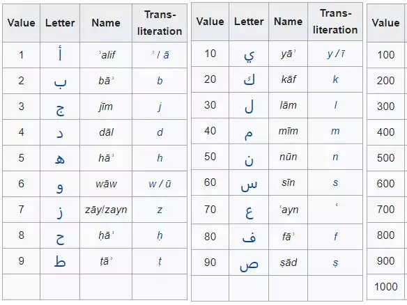

# Quran Scientific & Numerical Explanations

)

---

## 📌 Project Details
> **Note :**
> For Most of the numerical claims in this app The code to count the numerical claims are written in background, fetched from kaggle Quran Dataset.

---

## 📖 Overview
**Quran Scientific & Numerical Explanations** is an interactive Streamlit application designed to bridge the gap between quantitative text analysis and theological study. It serves as a digital companion that visualizes numerical patterns, calculates numerical values, and provides scientific context to specific verses.

The tool aggregates data from multiple sources to provide users with a "data-driven" perspective on Quran, allowing for exploration of numerical symmetry and scientific correlations mentioned in modern exegesis.

## ✨ Key Features

### 1. 🤖 Context-Aware Chatbot
A specialized Retrieval-Augmented Generation (RAG) style chatbot that assists users in exploring the text.
* **Multi-Source Retrieval:** Uniquely architected to retrieve and synthesize answers from **5 distinct validated resources** ensuring accuracy and depth.
* **Domain Specificity:** Designed to handle queries related to numerical miracles and scientific interpretations without hallucinating outside its knowledge base.

### 2. 🔢 Numerical & Linguistic Analysis
Abjad here refers to a system of assigning numerical values to the letters of the Arabic alphabet, also known as hisab al-jummal. 

* **Abjad Calculator:** Algorithms to compute the traditional numerical values of Arabic letters and words instantly.
* **Pattern Visualization:** Visualizes frequency distributions and word repetition patterns to highlight linguistic symmetry.

### 3. 🧪 Scientific Explanations
* **Curated Insights:** A structured module that presents verses alongside their modern scientific interpretations (e.g., embryology, cosmology).
* **Interactive Explorer:** Users can navigate through different scientific categories to see relevant textual evidence.

---

## 🛠️ Tech Stack
* **Frontend/Framework:** [Streamlit](https://streamlit.io/) (for rapid interactive UI development)
* **Language:** Python
* **Data Processing:** Pandas, NumPy, FIASS Indexing
* **Natural Language Processing:** Custom tokenization and pattern matching algorithms
* **Architecture:** Modular design with separation of concerns (`app_pages`, `utilities`).

**Note : Cross Checking every claim made in this app is still recommended**
---
